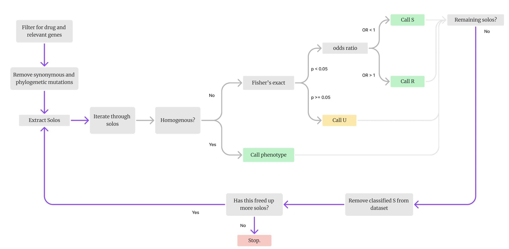

[](https://codecov.io/gh/fowler-lab/catomatic) [](https://doi.org/10.5281/zenodo.14917920)

# catomatic

catomatic is a Python toolkit for algorithmically constructing antimicrobial resistance (AMR) mutation catalogues directly from variant calls generated by read mapping. Rather than relying on alignment-level pattern matching or predefined resistance motifs, the tool infers resistance associations statistically from observed genotype–phenotype relationships, supporting both binary frequentist and regression-based modelling approaches.

This design is particularly well suited to Mycobacterium species, where resistance is primarily driven by chromosomal point mutations, indels, and complex multi-locus interactions, and where horizontal gene transfer is rare. By operating on mapped mutation data rather than alignment outputs, the framework enables transparent evidence tracking, flexible statistical testing, and reproducible catalogue construction tailored to the evolutionary and genomic characteristics of mycobacteria.

For aligment-relevant approaches, see AMRverse.

## Introduction

This repo contains 2 approaches to build resistance catalogues:

1. **Definite defectives (solo-based approach)**
2. **Interval regression**

The first is used in [https://doi.org/10.1101/2025.01.30.635633](https://doi.org/10.1101/2025.01.30.635633), and the second is a Python translation of the method used in [https://doi.org/10.1038/s41467-023-44325-5](https://doi.org/10.1038/s41467-023-44325-5).

---

## Binary Builder

This method relies on the logic that mutations that do not cause resistance can co-occur with those that do. If a mutation in isolation (solo) does not cause resistance, then it is not contributing to the phenotype when present in a mixture either.

Mutations that occur in isolation across specified genes are traversed in sequence, and if their proportion of drug-susceptibility (vs. resistance) passes the specified statistical test, they are characterized as benign (susceptible) and removed from the dataset. This step repeats iteratively until no more solo benign mutations are found.

Remaining mutations are classified based on their resistance rates and statistical test results. Those that don’t meet thresholds are labeled as `U`.

The classification approach supports:

- **No test**: assumes homogeneous susceptibility is sufficient for S
- **Binomial test**: against a specified background resistance rate
- **Fisher's test**: using a contingency background

### Optional Interventions

1. **Seeding**: You can pre-seed the catalogue with known neutral mutations.
2. **Overrides**: You can override or supplement the final catalogue with manual or rule-based entries.

Because the method uses GARC1 grammar, rules like `{rpoB@*_fs:R}` can be supplied post-hoc. These rules can:

- Be additive (lower priority than specific entries)
- Replace matching mutations (requires `replace=True` and `wildcards` supplied)

The catalogue can be returned as a dictionary or a Piezo-compatible `pandas.DataFrame`.

Contingency tables, proportions, p-values, and Wilson confidence intervals are stored in the `EVIDENCE` field.

### Example Workflow using Fisher's:



---

## Regression Builder

The Regression Builder implements a mixed-effect interval regression-based approach for catalogue construction to generate predicted mean MICs. It is suitable when the phenotypes are censored or uncesnored MICs.

If whole genome SNPs are provided, agglomerative clustering can compute random effects to control for population structure. Any given number of fixed-effects (such as lineage and lab) can also be defined by supplying additional input columns.

Similarly to the BinaryBuilder, catalogues can be exported as json objects or piezo-compatible tables.

---

## Installation

### Installation from source

Assuming in project directory (after git cloning)

```bash
pip install -e .
```

### Pypy installation

```bash
pip install catomatic
```

## Running catomatic's Binary Builder

You need two input DataFrames:

- **Samples**: one row per sample, with 'R' or 'S' phenotypes (`UNIQUEID`, `PHENOTYPE`)
- **Mutations**: one row per mutation per sample (`UNIQUEID`, `MUTATION`)

If exporting to Piezo format (`--to_piezo`):

- The `MUTATION` column must follow GARC1 grammar (`gene@mutation`)
- A path to a `wildcards.json` file (containing mutation rules) must be provided

### Python/Jupyter Example

```python
from catomatic.BinaryCatalogue import BinaryBuilder

# Build catalogue
catalogue = BinaryBuilder(samples=samples_df, mutations=mutations_df).build()

# View dictionary version
cat_dict = catalogue.return_catalogue()

# Convert to Piezo-compatible format
catalogue_df = catalogue.build_piezo(
    genbank_ref='...',
    catalogue_name='...',
    version='...',
    drug='...',
    wildcards='path/to/wildcards.json'
)

# Optionally export to CSV
catalogue.to_piezo(
    genbank_ref='...',
    catalogue_name='...',
    version='...',
    drug='...',
    wildcards='path/to/wildcards.json',
    outfile='path/to/output.csv'
)
```

### CLI

After installation, the simplest way to run the catomatic catalogue builder is via the command line interface using the `binary` subcommand. You must use either `--to_piezo` or `--to_json` to specify the output format. Additional metadata is required when using `--to_piezo`.

#### Export to JSON

```bash
catomatic binary \
  --samples path/to/samples.csv \
  --mutations path/to/mutations.csv \
  --to_json \
  --outfile path/to/output/catalogue.json
```

#### Export to Piezo format

```bash
catomatic binary \
  --samples path/to/samples.csv \
  --mutations path/to/mutations.csv \
  --to_piezo \
  --outfile path/to/output/catalogue.csv \
  --genbank_ref '...' \
  --catalogue_name '...' \
  --version '...' \
  --drug '...' \
  --wildcards path/to/wildcards.json
```

### CLI Parameters

| Parameter          | Type    | Description                                                                                    |
| ------------------ | ------- | ---------------------------------------------------------------------------------------------- |
| `--samples`        | `str`   | Path to the samples (phenotypes) file. Required.                                               |
| `--mutations`      | `str`   | Path to the mutations file. Required.                                                          |
| `--outfile`        | `str`   | Output file path for saving the catalogue. Required with `--to_json` or `--to_piezo`.          |
| `--to_json`        | `flag`  | Export the resulting catalogue in JSON format. Optional.                                       |
| `--to_piezo`       | `flag`  | Export the resulting catalogue in Piezo-compatible CSV format. Optional.                       |
| `--genbank_ref`    | `str`   | GenBank reference string for Piezo export. Required with `--to_piezo`.                         |
| `--catalogue_name` | `str`   | Name of the catalogue. Required with `--to_piezo`.                                             |
| `--version`        | `str`   | Catalogue version. Required with `--to_piezo`.                                                 |
| `--drug`           | `str`   | Name of the drug. Required with `--to_piezo`.                                                  |
| `--wildcards`      | `str`   | Path to JSON file containing wildcard mutation definitions. Required with `--to_piezo`.        |
| `--test`           | `str`   | Type of statistical test to apply. One of: `None`, `Binomial`, or `Fisher`. Optional.          |
| `--background`     | `float` | Background mutation rate (0–1). Required if `--test Binomial` is used.                         |
| `--p`              | `float` | P-value threshold for statistical significance. Optional. Defaults to `0.95`.                  |
| `--tails`          | `str`   | Tail type for statistical test. One of: `one`, `two`. Optional. Defaults to `two`.             |
| `--strict_unlock`  | `flag`  | If set, disables classification of susceptible (`S`) mutations unless statistically confident. |

## Running catomatic's Regression Builder

You need two input DataFrames:

- **Samples**: one row per sample, with an MIC column (`UNIQUEID`, `MIC`)
- **Mutations**: one row per mutation per sample (`UNIQUEID`, `MUTATION`)

If exporting to Piezo format (`--to_piezo`):

- The `MUTATION` column must follow GARC1 grammar (`gene@mutation`)
- A path to a `wildcards.json` file (containing mutation rules) must be provided

### Python/Jupyter Example

```python
from catomatic.RegressionCatalogue import RegressionBuilder

# fit the model to generate mutation effects
model, effects = RegressionBuilder(samples=samples_df, mutations=mutations_df).predict_effects()

# classify effects and generate a catalogue (requires an ecoff)
catalogue = RegressionBuilder(samples=samples_df, mutations=mutations_df).build(ecoff=1.0)

# View dictionary version
cat_dict = catalogue.return_catalogue()

# Convert to Piezo-compatible format
catalogue_df = catalogue.build_piezo(
    genbank_ref='...',
    catalogue_name='...',
    version='...',
    drug='...',
    wildcards='path/to/wildcards.json'
)

# Optionally export to CSV
catalogue.to_piezo(
    genbank_ref='...',
    catalogue_name='...',
    version='...',
    drug='...',
    wildcards='path/to/wildcards.json',
    outfile='path/to/output.csv'
)
```

### CLI

Similarly to BinaryBuilder, one can instantiate RegressionBuilder from the command line:

#### Export to JSON

```bash
catomatic regression \
  --samples path/to/samples.csv \
  --mutations path/to/mutations.csv \
  --ecoff 1.0 \
  --to_json \
  --outfile path/to/output/catalogue.json
```

#### Export to Piezo format

```bash
catomatic regression \
  --samples path/to/samples.csv \
  --mutations path/to/mutations.csv \
  --ecoff 1.0 \
  --to_piezo \
  --outfile path/to/output/catalogue.csv \
  --genbank_ref '...' \
  --catalogue_name '...' \
  --version '...' \
  --drug '...' \
  --wildcards path/to/wildcards.json
```

### CLI Parameters

### CLI Parameters (Regression Builder)

| Parameter            | Type          | Description & default                                                                                                             |
| -------------------- | ------------- | --------------------------------------------------------------------------------------------------------------------------------- |
| `--samples`          | `str`         | Path to the samples file (CSV). **Required**.                                                                                     |
| `--mutations`        | `str`         | Path to the mutations file (CSV). **Required**.                                                                                   |
| `--genes`            | `str[]`       | List of RAV genes. Required when non-RAV genes appear in the mutations table (e.g. when clustering SNP distances). Default: `[]`. |
| `--dilution_factor`  | `int`         | Dilution factor used in processing. Default: `2`.                                                                                 |
| `--censored`         | `flag`        | Treat phenotype data as censored. Default: `False`.                                                                               |
| `--tail_dilutions`   | `int`         | Tail dilutions to use for uncensored data. Default: `1`.                                                                          |
| `--frs`              | `float`       | Fraction Read Support threshold. Default: `None`.                                                                                 |
| `--ecoff`            | `float`       | Epidemiological cutoff value for classification. If `None`, it will be computed. Default: `None`.                                 |
| `--b_bounds`         | `float,float` | Bounds for beta (fixed-effect) coefficients. Two floats: `(min max)`. Default: `(None, None)`.                                    |
| `--u_bounds`         | `float,float` | Bounds for random-effect coefficients. Two floats: `(min max)`. Default: `(None, None)`.                                          |
| `--s_bounds`         | `float,float` | Bounds for sigma (residual variance). Two floats: `(min max)`. Default: `(None, None)`.                                           |
| `--p`                | `float`       | Significance / confidence level. Default: `0.95`.                                                                                 |
| `--fixed_effects`    | `str[]`       | Column names to include as fixed effects. Default: `None`.                                                                        |
| `--random_effects`   | `flag`        | Perform SNP clustering and include cluster as a random effect. Default: `False`.                                                  |
| `--cluster_distance` | `float`       | Distance threshold for SNP clustering. Default: `1`.                                                                              |
| `--outfile`          | `str`         | Path to save output JSON or Piezo file. Required with `--to_json` or `--to_piezo`.                                                |
| `--options`          | `dict`        | Options passed to `scipy.optimize.minimize`. Default: `None`.                                                                     |
| `--L2_penalties`     | `dict`        | Regularisation penalties for fixed and random effects. Default: `None`.                                                           |
| `--to_json`          | `flag`        | Export the resulting catalogue to JSON format.                                                                                    |
| `--to_piezo`         | `flag`        | Export the resulting catalogue to Piezo-compatible CSV format.                                                                    |
| `--genbank_ref`      | `str`         | GenBank reference string for Piezo export. Required with `--to_piezo`.                                                            |
| `--catalogue_name`   | `str`         | Name of the catalogue. Required with `--to_piezo`.                                                                                |
| `--version`          | `str`         | Catalogue version. Required with `--to_piezo`.                                                                                    |
| `--drug`             | `str`         | Drug associated with the mutations. Required with `--to_piezo`.                                                                   |
| `--wildcards`        | `str`         | Path to JSON file containing wildcard mutation rules. Required with `--to_piezo`.                                                 |
| `--grammar`          | `str`         | Grammar used in the catalogue. Default: `GARC1`.                                                                                  |
| `--values`           | `str`         | Values used for predictions in the catalogue. Default: `RUS`.                                                                     |
| `--for_piezo`        | `flag`        | If set, enables Piezo-specific placeholder rows. Omit if not exporting to Piezo. Default: `False`.                                |

### Notes

- When using post-hoc rule updates via .update(), you must provide wildcards and set replace=True if you intend to override existing entries.
- For Piezo export, placeholder entries are inserted automatically if needed to satisfy parser requirements (R, S, and U must be represented).
- The EVIDENCE column includes contingency tables, proportions, confidence intervals, and p-values, and may optionally include sample IDs if `record_ids=True`.
- To build a catalogue with the regression builder, as currently implemented, requires an ecoff as it will compare the predited effected against the background to supply an R/S/U label
  - To only calculate predicted effects, this can be done in Python by calling RegressionBuilder.predict_effects()

## Citation

If you use catomatic in your research, please cite:

- https://doi.org/10.1099/mgen.0.001429
